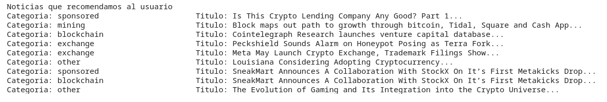

## Curso de Datos Masivos I, IIMAS-UNAM
Este repositorio contiene las diapositivas, libretas de trabajo y tareas del curso de Datos Masivos I impartido en la [Licenciatura en Ciencia de Datos](https://cienciadatos.iimas.unam.mx/) en el [IIMAS](https://www.iimas.unam.mx/).

# Prácticas
- Unidada 1 Conceptos básicos
  - [Practica Hello spark](https://nbviewer.org/github/gandres-dev/CursoDatosMasivosI/blob/master/notebooks/1a_hello_pyspark.ipynb)
- Unidada 2 Modelo de mapeo y reducción
  - [Practica MapReduce](https://nbviewer.org/github/gandres-dev/CursoDatosMasivosI/blob/master/notebooks/2a_map_reduce.ipynb)
  - [Practica Lazy evaluation](https://nbviewer.org/github/gandres-dev/CursoDatosMasivosI/blob/master/notebooks/2b_lazy_evaluation.ipynb)
  - [Practica Operaciones basicas](https://nbviewer.org/github/gandres-dev/CursoDatosMasivosI/blob/master/notebooks/2c_operaciones_basicas.ipynb)
- Unidad 3 Búsqueda de elementos similares
  - [Practica Funciones hash](https://nbviewer.org/github/gandres-dev/CursoDatosMasivosI/blob/master/notebooks/3a_funciones_hash.ipynb)
  - [Practica Indice inverso](https://nbviewer.org/github/gandres-dev/CursoDatosMasivosI/blob/master/notebooks/3b_indice_inverso.ipynb)
  - [Practica Minhash](https://nbviewer.org/github/gandres-dev/CursoDatosMasivosI/blob/master/notebooks/3c_minhash.ipynb)
  - [Practica Buscador imagenes](https://nbviewer.org/github/gandres-dev/CursoDatosMasivosI/blob/master/notebooks/3d_buscador_imagenes.ipynb)
  - [Practica LSH](https://nbviewer.org/github/gandres-dev/CursoDatosMasivosI/blob/master/notebooks/3e_lsh.ipynb)
  - [Practica HNMSlib](https://nbviewer.org/github/gandres-dev/CursoDatosMasivosI/blob/master/notebooks/3f_hnmslib.ipynb)
  - [Practica Minhash pyspark](https://nbviewer.org/github/gandres-dev/CursoDatosMasivosI/blob/master/notebooks/3g_minhash_pyspark.ipynb)

- Unidad 4  Algoritmos para flujos de datos
  - [Practica Muestreo presa](https://nbviewer.org/github/gandres-dev/CursoDatosMasivosI/blob/master/notebooks/4a_muestreo_presa.ipynb)
  - [Practica Streaming ejemplo basico](https://nbviewer.org/github/gandres-dev/CursoDatosMasivosI/blob/master/notebooks/4a_streaming_ejemplo_basico.ipynb)
  - [Practica Filtro Bloom](https://nbviewer.org/github/gandres-dev/CursoDatosMasivosI/blob/master/notebooks/4b_Filtro_Bloom.ipynb)
  - [Practica Elementos distintos](https://nbviewer.org/github/gandres-dev/CursoDatosMasivosI/blob/master/notebooks/4c_elementos_distintos.ipynb)
  - [Practica Momentos](https://nbviewer.org/github/gandres-dev/CursoDatosMasivosI/blob/master/notebooks/4d_momentos.ipynb)
  - [Practica Kafka step1 install](https://nbviewer.org/github/gandres-dev/CursoDatosMasivosI/blob/master/notebooks/4e_kafka_step1_install.ipynb)
  - [Practica Kafka step2 startKafka](https://nbviewer.org/github/gandres-dev/CursoDatosMasivosI/blob/master/notebooks/4e_kafka_step2_startKafka.ipynb)
  - [Practica Kafka step3 createTopic](https://nbviewer.org/github/gandres-dev/CursoDatosMasivosI/blob/master/notebooks/4e_kafka_step3_createTopic.ipynb)
  - [Practica Kafka step4 microservicio Twitter](https://nbviewer.org/github/gandres-dev/CursoDatosMasivosI/blob/master/notebooks/4e_kafka_step4_microservicio_Twitter.ipynb)
  - [Practica Kafka step5 microservicio pySpark](https://nbviewer.org/github/gandres-dev/CursoDatosMasivosI/blob/master/notebooks/4e_kafka_step5_microservicio_pySpark.ipynb)

--- 
## [Mini proyecto 1 Procesamiento y análisis de datos con PySpark](https://nbviewer.org/github/gandres-dev/CursoDatosMasivosI/blob/master/proyectos/01-miniproyecto/MD1-MiniProyectoI_Final.ipynb)

Base de datos utilizada: Yahoo Answers.

A partir de esta colección de documentos de texto se realizo lo siguiente:
- El número de ocurrencias totales de cada palabra, bigrama y trigrama en la colección.
- El número de documentos en los que ocurre cada palabra, bigrama y trigrama.
- Ordenación las palabras, bigramas y trigramas por su número de ocurrencias totales.
- Filtración de las palabras, bigramas y trigramas que ocurren en menos del 5% de los documentos de la colección.

## [Mini proyecto 2 Búsqueda de pares similares](https://nbviewer.org/github/gandres-dev/CursoDatosMasivosI/blob/master/proyectos/02-miniproyecto/DM-MiniProyectoII.ipynb)

Large Movie Review Dataset: http://ai.stanford.edu/~amaas/data/sentiment/

El proyecto consiste en la implementación de los métodos de búsquedas min hashing y índice inverso. Se evaluo con distintas funciones de distancias/similitud y se analizaron los resultados respecto a los pares recuperados al tiempo.

## [Mini proyecto 3 Análisis y procesamiento de flujos de datos](https://nbviewer.org/github/gandres-dev/CursoDatosMasivosI/blob/master/proyectos/03-miniproyecto/05-consumers/)

API utilizada: https://min-api.cryptocompare.com/

Aplicación que consume y procesa flujos de datos en tiempo real. Para su construcción, se uso Apache Kafka para la creación del productor, consumidor y tópicos. Para el procesamiento de los flujos de datos, se uso Spark Streaming como micro-servicio.

A treves de la API se consumieron los precios de diferentes divisas y noticias del bitcoin para hacer un analisis en tiempo real con los precios, ventanas deslizantes, creacion un de un arbitrage y filtro de bloom para noticias similares.

---
<!--
## Temario
**1. Conceptos básicos**
  - Definición y características
  - Generación, procedencia y preparación de datos
  - El principio de Bonferroni
  - Privacidad y riesgo
  - Modelos de computación para datos masivos
  
**2. Modelo de mapeo y reducción**
  - Sistema de almacenamiento y procesamiento distribuido
  - Modelo de programación
  - Algoritmos con el modelo de mapeo y reducción
  - Extensiones
  - El modelo costo-comunicación
  - Teoría de la complejidad para el modelo de mapeo y reducción
  
**3. Búsqueda de elementos similares**
  - Medidas de similitud y distancia Resúmenes de conjuntos con preservación de similitud
  - Funciones hash sensibles a la localidad
  - Métodos para altos grados de similitud
  - Aplicaciones
  
**4. Algoritmos para flujos de datos**
  - Modelos de flujo de datos
  - Muestreo
  - Filtrado
  - Conteo
  - Estimación de momentos
  - Búsqueda de los elementos más comunes

**5. Algoritmos de memoria externa**
  - Modelo de memoria externa
  - Modelo de caché inconsciente
  - Cotas fundamentales de operaciones de entrada y salida
  - Escaneo
  - Ordenamiento
  - Búsqueda
  - Estructuras de datos estáticos y dinámicos
 -->

<!--
## Horario
- Martes 10:00am a 11:30am
- Miércoles 13:00pm a 15:00pm
- Jueves 10:00am a 11:30am

## Criterios de evaluación
- Proyectos (50%)
- Tareas (30%)
- Exámenes (10%)
- Participación (10%)
-->
---
## Ambiente de programación
En este curso las herramientas de programación que se emplearán son las siguientes:
- [Google Colab](https://colab.research.google.com/)
- [AWS Educate](https://aws.amazon.com/es/education/awseducate/)
- [Databricks](https://databricks.com/)

## Datasets
- Una fuente de datos masivos para analizar es Registry of Open Data on AWS (https://registry.opendata.aws/).
- https://github.com/ColinEberhardt/awesome-public-streaming-datasets

---
## Profesores
**Blanca Hilda Vázquez Gómez**
  - Correo: blancavazquez2013@gmail.com
  
**Gibran Fuentes Pineda**
  - Correo: gibranfp@unam.mx

---

 ## Bibliografía
 - Jure Leskovec, Anand Rajaraman and Jeffrey D. Ullman. Mining of Massive Datasets. Second Edition. Cambridge University Press, 2014. [Liga](http://infolab.stanford.edu/~ullman/mmds/book.pdf)
 - Charu C. Aggarwal. Data Mining. Springer International Publishing, 2015. [Liga](https://doc.lagout.org/Others/Data%20Mining/Data%20Mining_%20The%20Textbook%20%5BAggarwal%202015-04-14%5D.pdf)
 - Jeffrey Vitter. Algorithms and Data Structures for External Memory. Now Foundations and Trends, 2008. [Liga](https://www.nowpublishers.com/article/Details/TCS-014)

